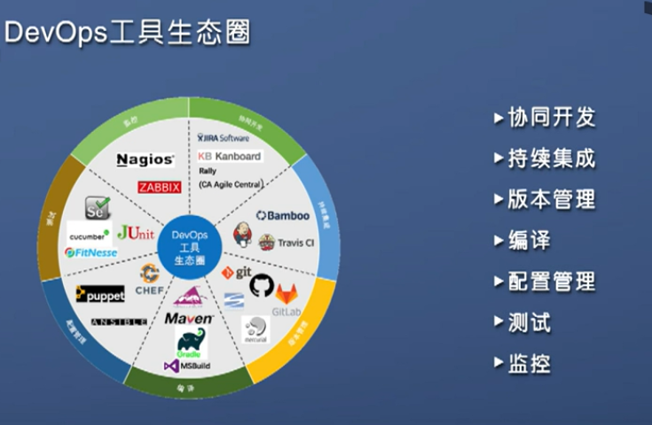
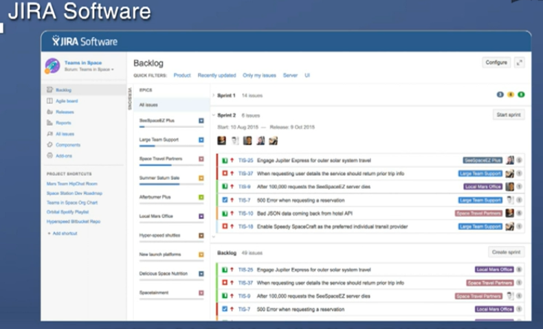
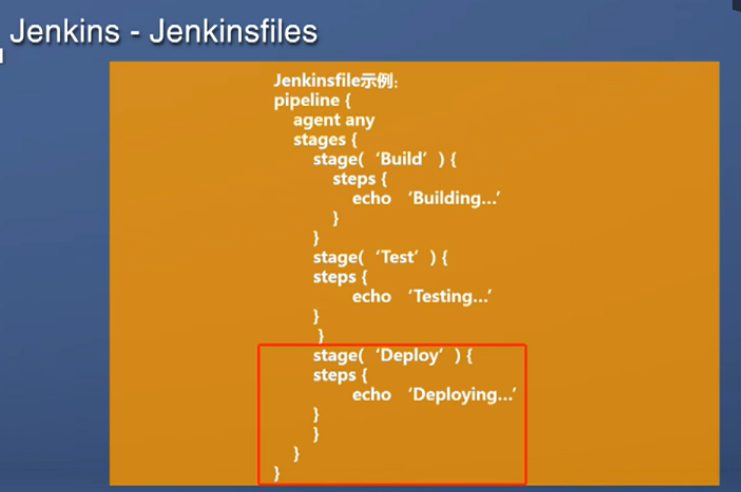
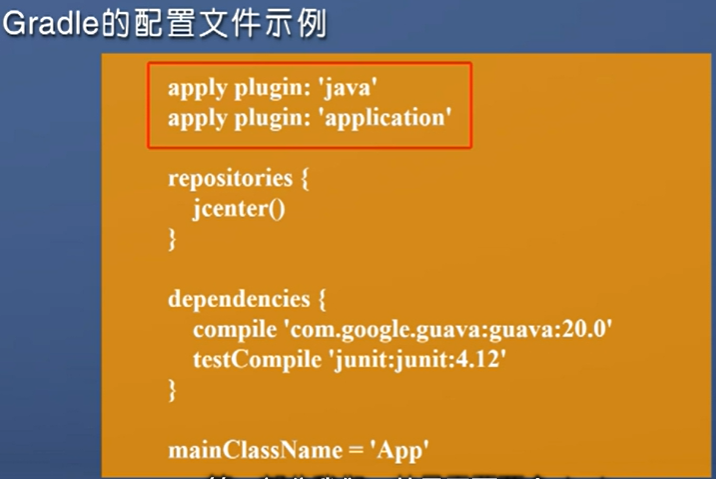
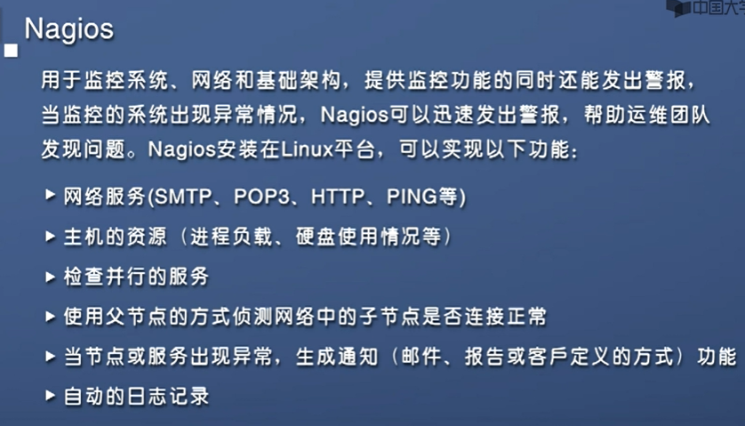
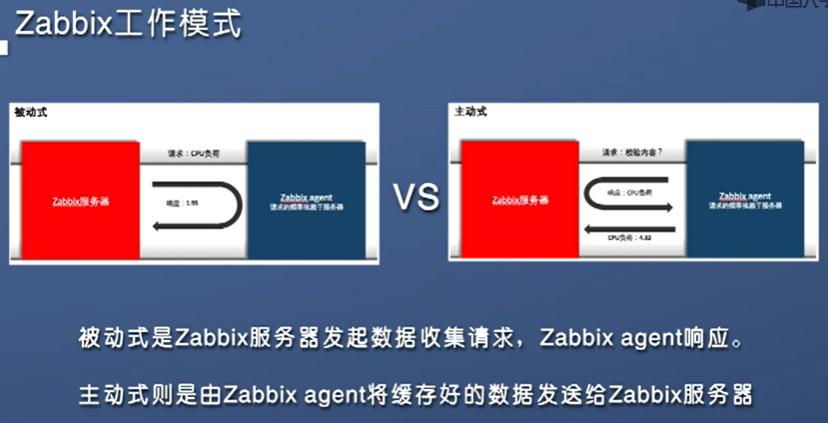
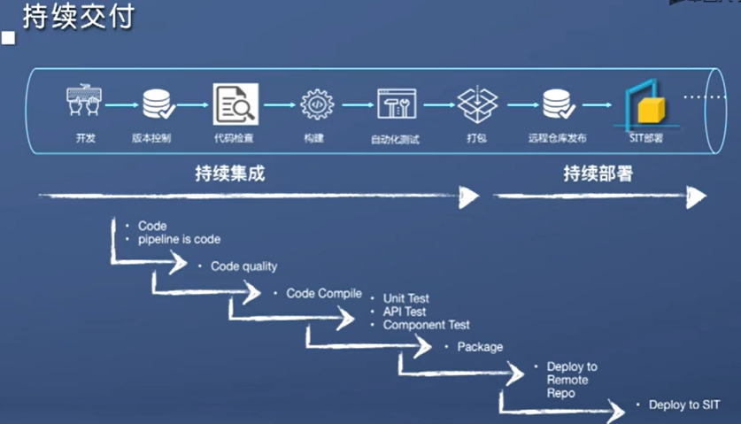
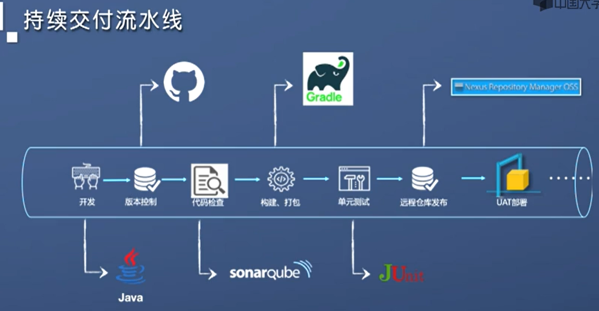

DevOps 工具生态圈
---

# 1. 开发工具导览

## 1.1. 协同开发工具
1. 敏捷开发
2. 可视化
3. 加强团队沟通修改
4. 数据分析
5. 工具:
   1. JIRA
   2. KanBan
   3. Rallt

### 1.1.1. JIRA
1. 广泛应用于敏捷开发
2. 产品经理创建看板和整个工作流程
3. 项目经理贯穿整个过程

## 1.2. 持续集成工具
1. Jenkins
2. Bamboo
3. Travis CI
4. TeamCity

### 1.2.1. Jenkins
1. 使用比较广
2. 自动化编译
3. 自动化测试
4. 自动化部署
5. 丰富的插件库
6. 配置简单
7. 工作流即代码(Pipeline-as-code)

## 1.3. 版本管理工具
1. Git
2. GitHub
3. GitLab
4. Subversion
5. Mercurial

## 1.4. 编译工具
1. Ant(最早的)
2. Maven(完全基于java)
3. Gradle
4. MSBuild(相对独立)

## 1.5. 配置管理工具
1. Chef(中英文)
2. Puppet(中英文)
3. Ansible(英文)
4. 完成环境配置

## 1.6. 测试工具
1. Junit(Java)
2. Selenium(UI测试)
3. Cucumber(自动化验收)
4. FitNesse(数据化测试)

## 1.7. 监控工具
1. Nagios

2. Zabbix:两种工作方式

# 2. 持续交付流水线

1. 工具选型(组建)
2. 团队内部可以通过搭建自己的Git仓库保证安全
3. sonarQube:进行代码检查，找到逻辑问题
4. 以下为一个Java工具链

5. 具体项目:Hello World的测试(Jenkins)
   1. 选择对应Hello World
   2. 按照对应的顺序进行部署
