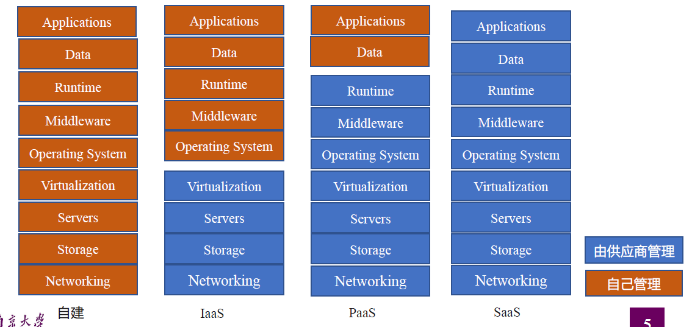
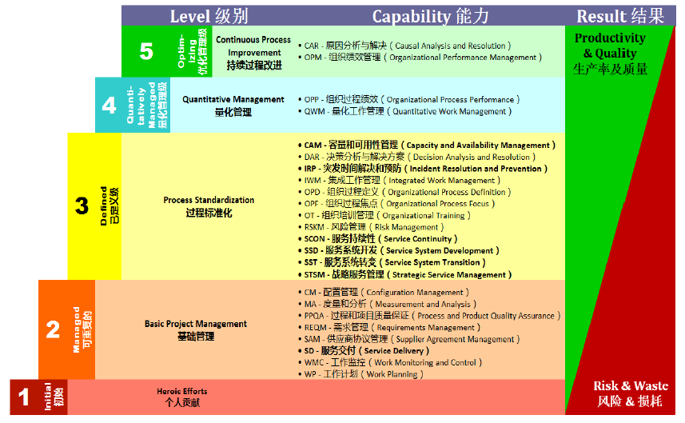
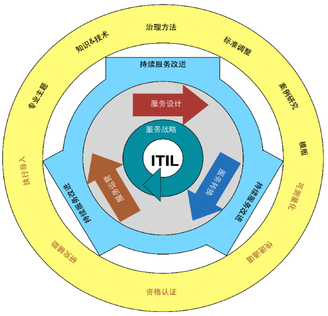
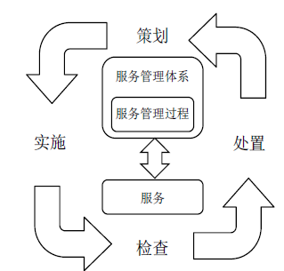
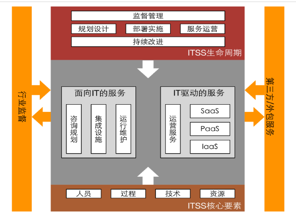

Lec02-云计算与云时代运维
---

# 1. 从云计算说起
1. 云计算是一种按量付费的模式，这种模式可以提供可用的、边界的、按序的网络访问，进入可配置的计算资源共享池(资源包括网络、服务器、存储、应用软件、服务)，这些资源能够被快速提供，只需投入很少的管理工作，或与服务供应商进行很少的交互。
2. 康慧法则：软件是由开发软件的团队架构决定的

# 2. XaaS - X as Service
1. 表示一切皆服务，它是一个统称(anything as s Service或everything as a Service )
2. XaaS强调的是下游对上游按照契约提供服务，隐藏实现细节，并且通常是通过网络的形式来提供服务，例如， SaaS，CaaS (Communication as a Service) 、 NaaS (Network as a Service)、DaaS (Development as a Service); Desktop as a Service)、MaaS (Monitoring as a Service) 

## 2.1. 最典型的三大XaaS
1. Software as a Service (SaaS) 软件即服务，软件分发方式，中心化，服务供用户订阅
2. Infrastructure as a Service (IaaS) 基础设施及服务，虚拟化，用户需要配置和部署中间件和应用服务
3. Platform as a service (PaaS) 平台即服务，服务供应商提供开发的整体环境.

## 2.2. 自建、IaaS、PaaS以及SaaS区别

1. 在线编辑文档是SaaS

## 2.3. 边缘计算
1. 云计算与边缘计算
2. 低延时、高可靠性、能耗以及数据安全等要求，例如
   1. 视频监控
   2. 智能家居
   3. 智慧城市
   4. 智能交通

# 3. IT服务标准
1. DevOps中"Ops”端最常见的形式就是以各种服务的方式提供给用户，因此，需要遵循一定的标准和要求
   1. CMMI-SVC
   2. ITIL
   3. ISO20000
   4. ITSS

## 3.1. CMMI-SVC

## 3.2. ITIL服务标准介绍
1. ITIL全称Information Technology Infrastructure Library（信息技术基础架构库）
2. ITIL最佳实践主要围绕5个部分：
   1. 服务战略
   2. 服务设计
   3. 服务转换
   4. 服务运营
   5. 服务改进

## 3.3. ISO20000
1. ISO20000是国际标准化组织发布的第一部针对信息技术服务管理(IT Service Management)领域的国际标准
2. ISO20000定义了“策划-实施-捡查-处置II(PDCA)方法论应用于服务管理体系(SMS)和服务的所有部分：
   1. P-策划：建立书面和协定的服务管理体系；
   2. D-实施：实施和运行服务管理体系，以设计、转换、交付和改进服务；
   3. C-检查：根据方针、目标、计划和服务需求，对服务管理体系进行监视、测量和回顾，并报告结果；
   4. A-处置：采取措施，以持续改进服务管理体系和服务的绩效。

## 3.4. ITSS
1. 信息技术服务标准(Information Technology Service Standards,简称ITSS)是一套成体系和综合配套的信息技术服务标准库

# 4. 再谈运维

## 4.1. 传统运维的转型之路