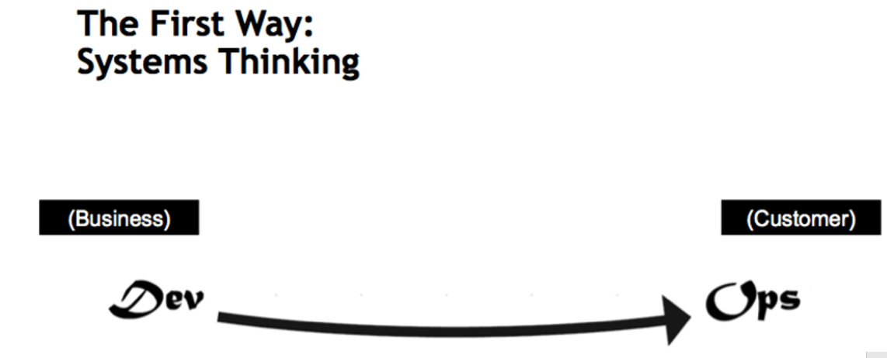
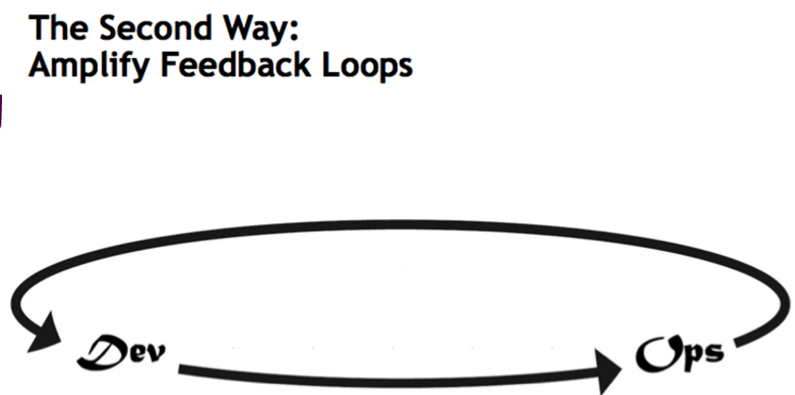
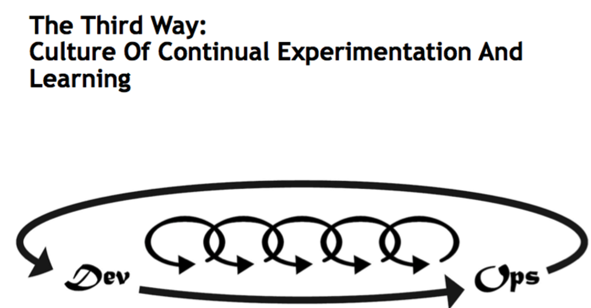

Lec1-从凤凰项目谈起
---

# 1. 基本背景
1. 《凤凰项目：一个IT运维的传奇故事》
2. 何一个没有完全了解IT部门的COO都是不合格的，在核心的部分都不得不依赖别人。
3. 最后20页有很充分的总结

## 1.1. 面临的问题
1. 外部竞争：竞争对手的冲击
2. 内部混乱和争斗
   1. 薪资系统、库存管理系统的混乱
   2. 开发和运维之间的矛盾
   3. 安全部门和运维之间的矛盾
   4. 大量工作积压——人员瓶颈
   5. 权利斗争、资源竞争

## 1.2. 一些措施
1. 变更可视化：工具导入和过程落实的问题(看板)
2. 解放资源约束：保护、共享和容忍
3. 安全审计：角色转变——共同目标
4. 运维自动化

# 2. 三步工作法

## 2.1. 第一工作法

1. 概念
   1. 充分理解工作流(开发-运维-客户)，是关于从开发到IT运维再到客户的整个自作向右的工作流。
   2. 流量最大化(小批量、缩小任务间隔、缺陷控制)，不让缺陷流向下游工作重心。
   3. 不断为了整体目标(相对于开发功能完成率、测试发现/修复比率或运维有效性指标等局部目标)的实现而优化工作流
2. 部分关键实践和方法
   1. 持续构建、集成和部署
   2. 按需创建环境
   3. 限制半成品(WIP)
   4. 构建 支持顺利变更的安全系统
   5. 看板（任务可视化）

## 2.2. 第二工作法

1. 概念
   1. 价值流(开发-运维-客户)的快速持续反馈流，放大其效益
   2. 避免问题再次发生(或者快速发现和修复)
   3. 从源头上保证质量
2. 部分关键实践和方法
   1. 适时停止生产线：部署流程中的构建和测试失败
   2. 持续改进
   3. 构建自动化测试套件，确保代码随时可部署
   4. Dev和Ops共享目标和pain
   5. 远程监测手段(自动化)

## 2.3. 第三工作法

1. 概念：创建培育良好的文化(不断尝试、重复和练习)
   1. 不断尝试，这需要承担分享并从成功和失败中吸取经验教训
   2. 理解重复和联系是熟练掌握的前提
2. 部分关键实践和方法
   1. 营造用于创新、敢于冒险以及高度信任的企业文化
   2. 确保至少20%资源投入在非功能需求上
   3. 不断鼓励和强化改进。

# 3. 四种典型IT工作类型

## 3.1. 业务项目
1. 大部分支持企业业务计划的开发项目
2. 典型的，由公司项目管理办公室来跟踪和管理

## 3.2. IT内部项目
1. 由上述业务项目衍生出来的基础架构或者IT运维项目和内部的一些改进项目。
2. 典型的，不是集中跟踪和管理。
3. 当IT运维瓶颈出现时，投入的生产能力不易于弄清。

## 3.3. 变更
1. 由上述两类项目引起。
2. 往往通过问题跟踪系统(IT Remedy，JIRA，Git等等)来跟踪和管理。
3. 多套系统的问题。

## 3.4. 计划外工作
1. 操作事故和问题。
2. 一旦发生，前述问题的解决会受到影响。

## 3.5. IT工作可视化和WIP控制图示

# 4. 精益生产和Devops
1. 传统行业的精益生产和DevOps原理相同
2. 精益理论
   1. 降低批量规模
   2. 减少半成品
   3. 缩短并且增强反馈回路
3. 效果：大大压缩时间等
4. DevOps是IT价值流中应用精益理论的结果

# 5. 什么是Devops
1. DevOps是运维和开发工程师共同参与整个服务生命周期的实践，从设计到开发过程再到生产支持。
2. DevOps的另一个特点是运维人员在他们的系统工作中使用许多与开发人员相同的技术。

## 5.1. 敏捷开发的5个层次与Devops
1. 敏捷开发的5个层次
   1. 敏捷价值观：哲学，敏捷宣言
   2. 敏捷原则：战略方法（拥抱变更等）
   3. 敏捷方法：具体流程实现，例如XP、Scrum等。
   4. 敏捷实践：高度具体的战术技术，例如，站会、规划扑克、积压、CI等。
   5. 敏捷工具：特定的技术实现，例如 JIRA、版本一等。
2. Devops的5个层次
   1. Devops价值：工作软件 -> 服务或交付的软件
   2. Devops原则：扩大敏捷原则以包括系统和操作，例如，基础设施即代码
   3. Devops方法：与敏捷相同，除了几种不同的方法，例如，Visible Ops 风格的变更控制
   4. Devops实践：CD、工具链、虚拟化和云计算、指标和监控方案，
   5. Devops工具：工具爆炸，例如 jenkins、travis、teamcity、ansible、mesos、OpenStack、docker

## 5.2. Devops的关键术语

### 5.2.1. CI/CD
1. 持续集成(Continuous Integration, CI)：是一种开发实践，需要开发人员每天多次将代码集成到共享存储库中。然后每次签入都通过自动构建进行验证，从而使团队能够及早发现问题。
2. 持续交付(Continuous Delivery, CD)：是一套流程和实践，可以从根本上消除软件生产过程中的浪费，能够更快地交付高质量的功能，并在您的企业和用户之间建立快速有效的反馈循环
3. 持续部署(Continuous Deployment, CD)：意味着您实际上会立即部署并向用户公开更改。

### 5.2.2. 不同级别的云服务
1. 软件即服务(SaaS)：是一种软件许可和交付模型，其中软件在订阅的基础上获得许可并集中托管。
2. 基础设施即服务(IaaS)：云托管的虚拟机通常按“现收现付”收费。用户可以完全控制机器，但需要自己安装和配置任何所需的中间件和应用程序。
3. 平台即服务 (PaaS)：PaaS供应商为应用程序开发人员提供开发环境。提供商通常会开发工具包和标准，以及用于分销和支付的渠道。

### 5.2.3. 指标
1. 部署频率：您的组织多久部署一次代码？
2. 变更进入生产的时间：从代码提交到代码在生产中成功运行需要多长时间？
3. 平均恢复时间(MTTR)：发生服务事件一般需要多长时间恢复服务
4. 改变失败率：有多少百分比的更改会导致服务降级或随后需要修复？

### 5.2.4. 流水线与编排
1. 流水线：为了让应用从概念到生产，工程师们都按照顺序和最终例行的步骤工作。
2. 流水线编排：使构成持续交付管道的各种自动化任务能够在正确的时间被调用的工具或产品。 它们通常还会记录每个任务的状态和输出，并可视化通过管道的特征流。

### 5.2.5. 容器与Docker
1. 容器：容器为虚拟机提供了一种轻量级的替代方案，它们使开发人员能够使用相同的DEV环境和堆栈。他们还通过鼓励使用无状态设计来促进DevOps。
2. Docker：Docker是一个开源项目，可在软件容器内自动部署Linux应用程序。引用Docker官方描述的功能：Docker容器将一个软件封装在一个完整的文件系统中，该文件系统包含它运行所需的一切：代码、运行时、系统工具、系统库——任何你可以安装在服务器上的东西。这保证了它总是以相同的方式运行，而不管它在什么环境中运行。

### 5.2.6. 微服务
1. 微服务架构一词在过去几年中如雨后春笋般涌现，用来描述将软件应用程序设计为可独立部署的服务套件的特定方式。虽然这种架构风格没有精确的定义，但围绕业务能力、自动化部署、端点智能以及语言和数据的分散控制，围绕组织存在某些共同特征。

### 5.2.7. 版本管理工具
1. Git：Git是一个分布式版本控制系统，强调速度、数据完整性和对分布式非线性工作流的支持。Git 最初由 Linus Torvalds 于2005年为Linux内核开发设计和开发，此后成为软件开发中最广泛采用的版本控制系统。
2. GitHub：GitHub是一种基于Web的Git存储库托管服务，它提供Git的所有分布式修订控制和源代码管理(SCM)功能以及添加自己的功能。与严格意义上的命令行工具Git不同，GitHub提供基于Web的图形界面和桌面以及移动集成。

### 5.2.8. 测试
1. A/B测试：一种技术，其中新功能或功能的不同变体可用于不同的用户集，并通过比较指标和用户行为进行评估。