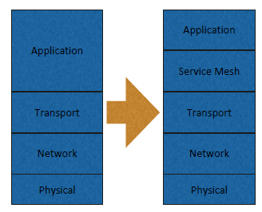
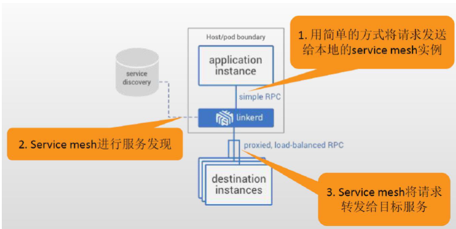
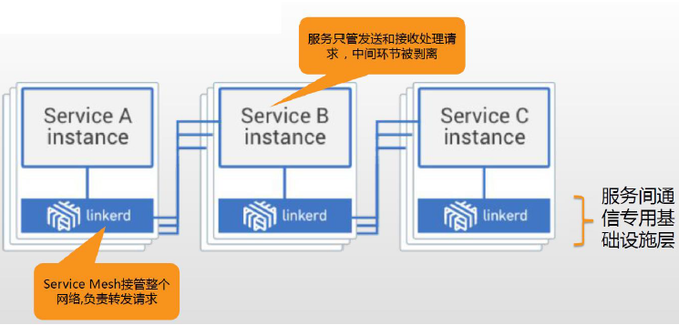

Lec10-微服务开发与部署
---

# 1. 微服务开发
1. 单体应用程序
   1. 数据库的表对所有模块可见
   2. 一个人的修改整个应用都要重新构建、测试、部署
   3. 整体复制分布式部署，不能拆分按需部署
2. 微服务架构模式的特征
   1. 应用程序分解为具有明确定义了职责范围的细粒度组件
   2. 完全独立部署，独立测试，并可复用
   3. 使用轻量级通信协议，HTTP和JSON，松耦合
   4. 服务实现可使用多种编程语言和技术
   5. 将大型团队划分成多个小型开发团队，每个团队只负责他们各自的服务
3. Spring Boot和Spring Cloud
   1. Spring Boot提供了基于Java的、面向REST的微服务框架
   2. Spring Cloud使实施和部署微服务到私有云或公有云变得更加简单

# 2. 下一代微服务：Service Mesh
1. 一种基础设施层，服务间的通信通过Service Mesh进行。
2. 可靠地传输复杂网络拓扑中服务的请求，将服务变成现代的云原生服务。
3. 一种网络代理的实现，通常与业务服务部署在一起，业务服务不感知。
4. 一种TCP/IP之上的网络模型。

## 2.1. 部署模型：单个服务调用，表现为sidecar

## 2.2. 部署模型：多个服务调用，表现为通讯层

## 2.3. 部署模型：有大量服务，表现为网络

## 2.4. 为什么使用Service Mesh
1. 无需多种语言的微服务框架开发
2. 对业务代码0侵入
3. 不适合改造的单体应用
4. 开发出开的应用既是云原生的又具有独立性
