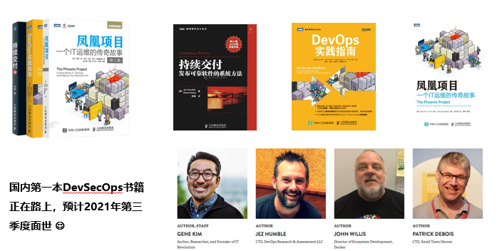
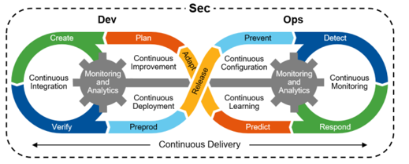

Lec11-DevSecOps
---

# 1. Devops 必读书和四大天王

# 2. DevSecOps 简介

## 2.1. 产生背景
1. 从2016年开始，应用程序层逐渐成为数据泄露的主要原因
2. 信息泄露给企业、个人带来的损失越来越大，可严重影响公司品牌，大幅度降低企业估值，令企业面临巨额赔偿，威胁个人财产和生活稳定等。

## 2.2. 什么是DevSecOps
1. 2012年，Gartner创建了DevSecOps概念，其原始术语为DevOpsSec
2. DevSecOps 旨在将安全性嵌入研发过程的每个部分（比如，需求，架构设计，开发，测试和运维等）。这意味着将应用安全思维模式左移到开发团队

3. DevSecOps 通过在 DevOps 流程的每个阶段或检查点构建安全性来消除 DevOps 和信息安全之间的障碍，从而更快，更安全地生成高质量地代码

## 2.3. 为什么需要DevSecOps
1. DevOps 的快速交付与传统安全模式形成冲突，让安全性成为束缚快速交付的瓶颈
2. DevSecOps 的好处包含：
   1. 快速交付
   2. 控制风险
   3. 节省成本

# 3. DevSecOps现状
1. 连续三年仍有一半左右的开发者承认他们没有时间去处理安全问题。再次验证了整体来说，安全仍然只是口头层面的重视

# 4. DevSecOps工具和产品
1. 静态应用安全工具（SAST）
   1. 优势
      1. 白盒测试，代码具有高度可视性，安全漏洞精准定位，检测问题类型更丰富
      2. 不需要用户界面，漏洞发现更及时
      3. 容易被程序员接受
   2. 劣势
      1. 区分开发语言和平台，误报多，人工成本高
      2. 扫码时间随着代码量的提高显著变长
      3. 不能测试整个问题，集成系统的漏洞发现不了
2. 动态应用安全工具(DAST)
   1. 优势
      1. 攻击者视角，可发现大多数高风险问题
      2. 黑盒测试，无需源代码，测试对象范围较广
      3. 支持当前的各类主流编程语言开发的应用
   2. 劣势
      1. 对测试人员有一定的专业要求
      2. 大部分工具不能被自动化
      3. 无法定位漏洞的具体位置
      4. 较强入侵性，安全测试的脏数据会污染业务测试数据
3. 交互式应用安全工具（IAST）
   1. 优势
      1. 漏洞检出率和准确性高，误报漏极低，漏洞信息详细度高
      2. 测试过程无感知，漏洞发现快
   2. 劣势
      1. 每次更新agent需要重启webserver, 部署成本较高
      2. 无法测试业务逻辑漏洞

