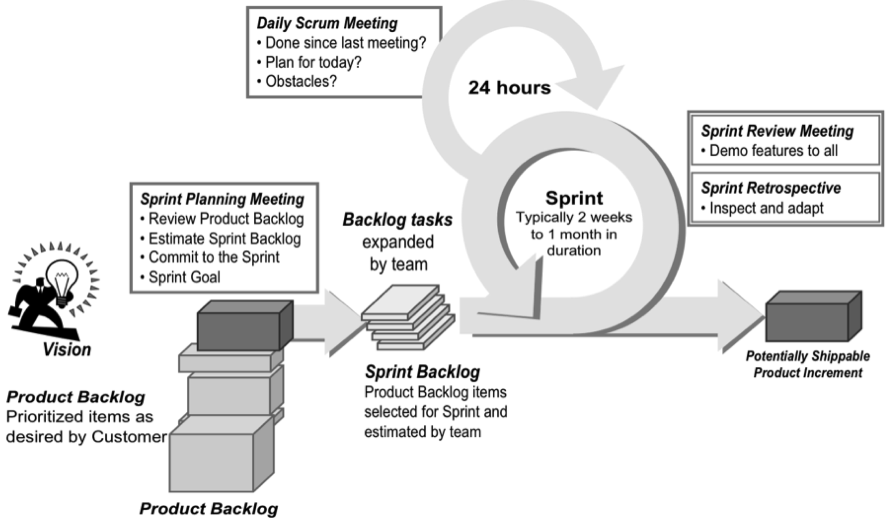
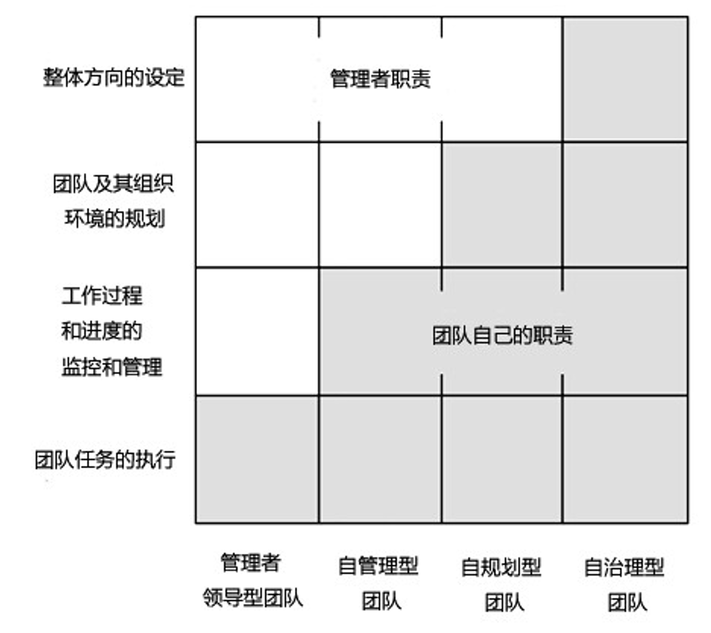
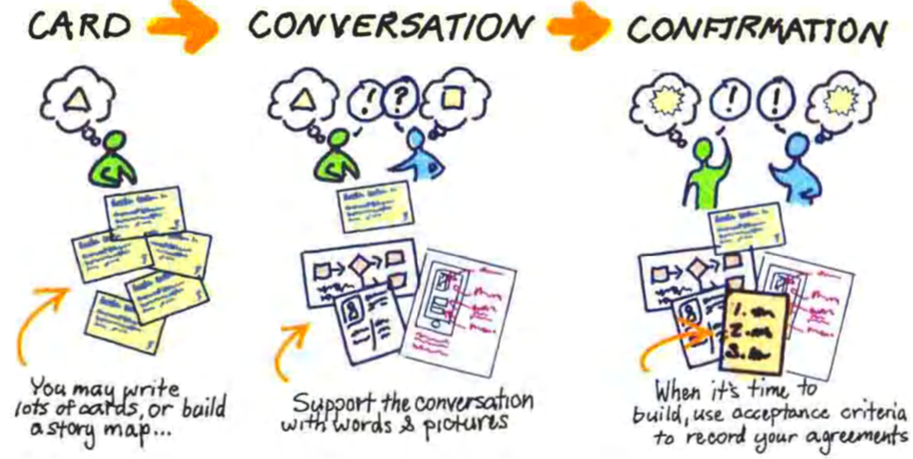
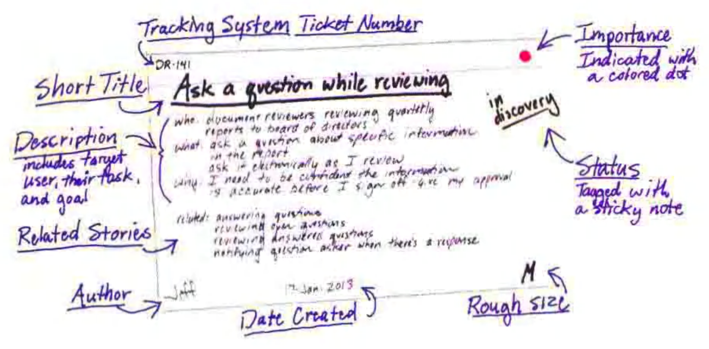
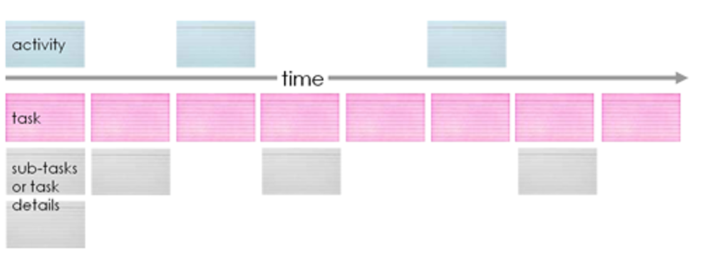
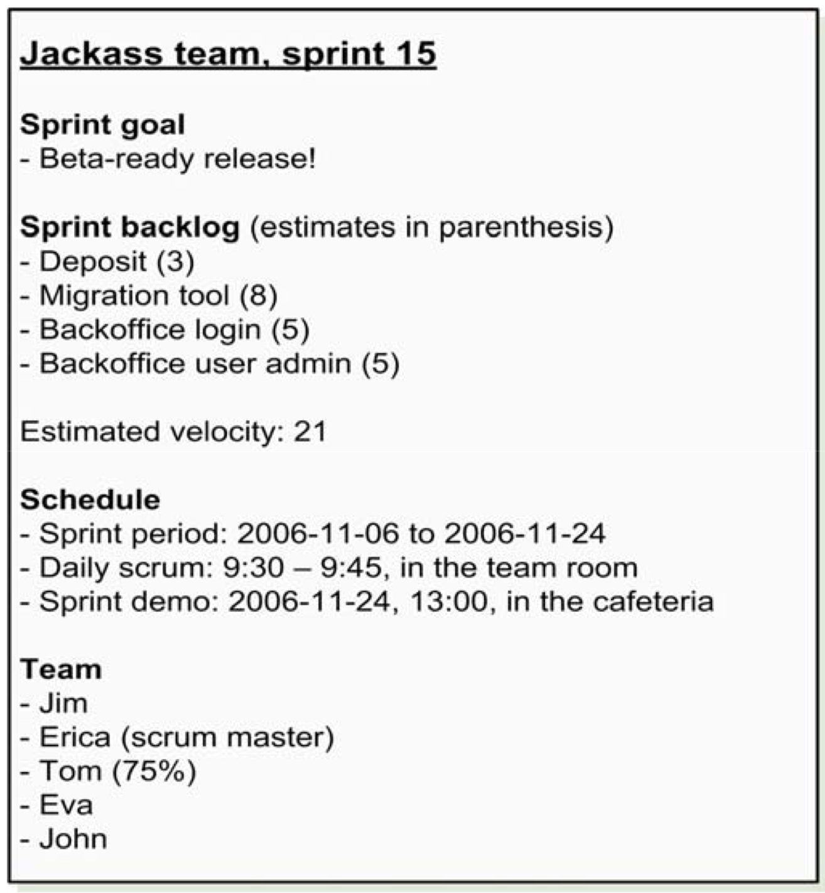
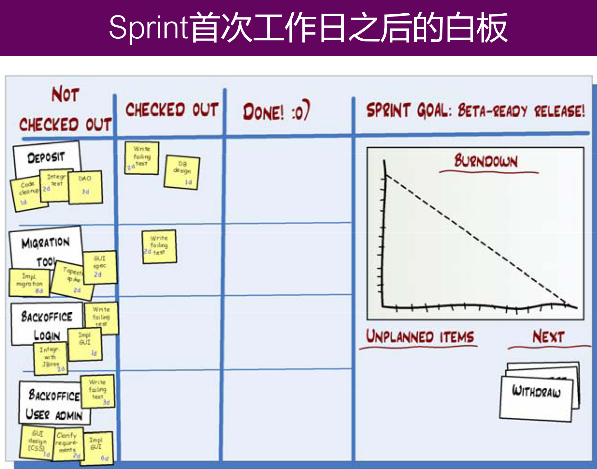
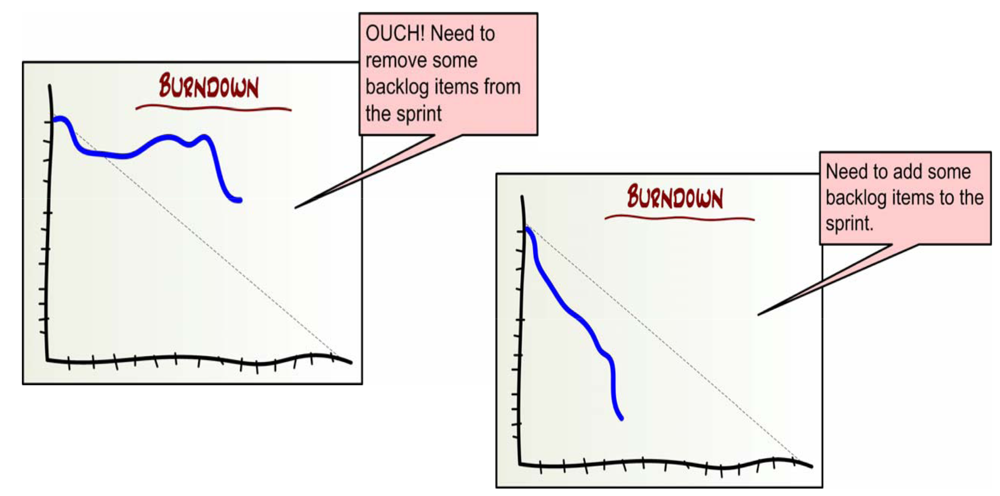
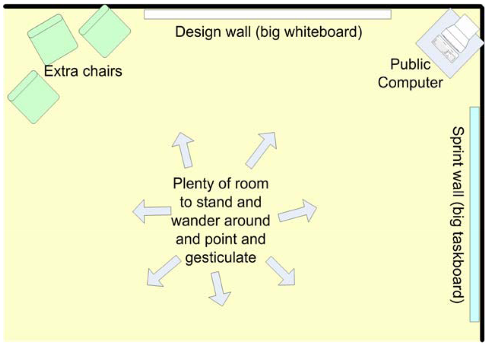

Lec03-敏捷软件开发方法 Scrum
---

# 1. Scrum历史
1. Scrum在英语是橄榄球运动中争球的意思。
2. 1986年，"The New New product Development Game" 竹内弘高和野中郁次郎阐述了一种新的整体性的方法，该方法能够提高商业新产品开发的速度和灵活性：他们将这种新的整体性方法与橄榄球相比较，前者各阶段相互重叠，并且由一个跨职能团队在不同的阶段完成整个过程，而团队"作为一个整体前进，把球传来传去"。
3. 1995年，在奥斯汀举办的OOPSLA'95上，Sutherland和Schwaber联合发表了论文首次提出了Scrum概念。
4. Schwaber还设计课程来认证个体对scrum的理解，认证Scrum-Master (CSM) 称号应运而生，随后是认证Scrum产品负责人(CSPO)、认证Scrum 实践者(CSP)、认证Scrum培训师(CST)和认证Scrum教练(CSC)。 
5. 大多数scrum实践者认定Ken Schwaber的早期版本就是scrum的事实标准。
6. 没有人拥有scrum，没有 scrum 标准。

# 2. Scrum
1. Scrum 不是构建产品的一种过程或一项技术，是**一个框架**，在这个框架里可以应用各种流程和技术。Scrum 能使产品管理和开发实践的相对功效显现出来，以便随时改进。
2. Scrum以整体的形式存在，才能作为其他技术、方法论和实践的容器良好运作。



## 2.1. Scrum 3355
1. 三个角色
   1. Scrum Master
   2. Product Owner(产品负责人)
   3. Team(团队)
2. 三个工件
   1. Product Backlog(产品待办事项)
   2. Sprint Backlog(Sprint 待办事项)
   3. 可交付产品增量(也有说是燃尽图)
3. 五大仪式(事件)
   1. Sprint(冲刺)
   2. Sprint Planning(Sprint规划)
   3. Sprint Daily Standup(每日站会)
   4. Sprint Review(Sprint 评审)
   5. Sprint Retrospective(回顾)
4. 五大价值观
   1. Coverage(勇气)
   2. Openness(开放)
   3. Focus(专注)
   4. Commitment(承诺)
   5. Respect (尊重)

## 2.2. Scrum角色
1. Scrum团队里的人们多来自传统领域，头衔可能各不相同，例如架构师、业务分析师、设计师、软件开发者、测试人员、文档专家、产品经理、项目经理等等。 
所有这些技能集scrum团队都需要，但 scrum只承认三个互不相同的角色：Scrum Master、Product Owner(产品负责人)、Team(团队)

### 2.2.1. Product Owner 产品负责人
1. 产品负责人负责**最大化产品以及开发团队工作的价值**。产品负责人是**唯一**有权要求团队做事以及改变列表条目优先级的人。
   1. 持有产品愿景
   2. 代表业务(the business)
   3. 代表客户
   4. 拥有产品列表
   5. 划定故事优先级
   6. 设立故事的接收标准
   7. 有空回答团队成员们的问题。
2. 产品负责人和团队其他人之间有一层天生的紧张关系，产品负责人总想要更多，而团队则必须维护可持续的速率。只要不是单方面说了算，这层紧张关系就还是有益的。 
3. 不要合并产品负责人和Scrum Master。
4. 产品负责人是管理产品待办事项列表的唯一责任人。产品待办事项列表的管理包括: 
   1. 清晰地表达产品代办事项列表条目
   2. 对产品代办事项列表中的条目进行排序，最好地实现目标和使命
   3. 确保开发团队所执行工作的价值
   4. 确保产品代办事项列表对所有人可见、透明、清晰,并且显示Scrum团队的下一步工作
   5. 确保开发团队对产品代办事项列表中的条目达到一定程度的理解

### 2.2.2. Scrum Master
1. Scrum Master负责确保Scrum被理解并实施。
2. Scrum master担当教练角色，引领团队达到更高级的凝聚力、自组织和表现。Scrum Master 以各种方式服务于开发团队,包括: 
   1. 指导开发团队自组织和跨功能
   2. 教导并领导开发团队创造高价值的产品
   3. 移除开发团队进展过程中的障碍
   4. 按需推动Scrum事件
   5. 在Scrum还未完全被采纳和理解的组织环境下指导开发团队
   6. Coach and Teacher
3. Scrum master也有可能一并担当直接贡献的责任。这种情况下我们称之为工作型(working) scrum master，或贡献型(contributor) scrum master。 

### 2.2.3. Team(团队)
1. 自组织团队选择如何最好地完成他们的工作，而不是由团队外的其他人来指使他们。
2. 全功能团队拥有完成工作所需要的全部技能，不需要依赖团队外部的人(特性团队)。
3. 通常是七个人，再或多或少两个人，也就是说，五个到九个人。 一共11人。

#### 2.2.3.1. 全功能团队、特性团队
1. 全功能团队
   1. 全功能团队是具有不同职能专业或多学科技能的团队。当一个团队拥有满足需求的所有技能和资源时，就称为真正的跨职能。这意味着它不依赖于跟其他团队的工作交接，也不用等待其他团队的工作。
   2. 反例：职能团队，U I团队、业务逻辑团队、测试团队和数据团队等等。团队等待，责任扯皮，交流沟通成本剧增。
2. 特性团队
   1. 一种组建跨职能团队的常见方式是让团队对某个特性负责。有些人将其称之为特性团队。这个团队对于某个特性从开始到结束全程负责。 
   2. 反例：组件团队，即只是负责数据访问层或用户接口层的团队。当按照这种方式组建团队时，就要承担开发特性时一个团队等待另一个团队的风险。

#### 2.2.3.2. 自组织团队
1. 《为什么我们需要自组织团队》提出必须让团队竭尽他们所有的专业能力，不仅仅是完成他们的工作任务，还要自我监督和控制，自己做决定，甚至设计自己的流程。 
2. 自组织性高的团队往往也能够比其他团队带来更多的好处，比如能够传递更多的商业价值、更加高效地协同工作以及学的更快等。 
3. **降低管理成本！**
4. Hackman权利矩阵



#### 2.2.3.3. 猪与鸡的比喻
1. 猪角色被认为是团队中的核心成员,在一个团队中产品的负责人和Scrum主管和开发团队就是"猪"角色。鸡角色不是Scrum的一部分,但必须要考虑他们，用户，客户或提供商，经理等扮演着"鸡"角色!
2. **把有兴趣关心，并无利益或价值牵扯的人，排除在项目决策团队以外！**

## 2.3. 用户故事
1. 在20世纪90年代末，Kent在开发软件的过程中发现，其中最大的问题莫过于使用文档来精确描述我们想要的东西，即需求。 
2. **同样的一份文档，阅读的人不同，各自得到的信息也不一样**。这种缺乏共识的情况，称为 "低质量的需求" 
3. 停止写出完美文档的"执念"。
4. 用户故事之所以得名，并不是要人们如何写出更好的用户故事，而是如何在协作中更好地使用它。 

### 2.3.1. 需求——用户故事模板
1. 用户故事是产品列表的基础构件。
2. 用户故事模板
   1. 用户角色(who)
   2. 功能(what)
   3. 为什么(why)

```
作为 <某类用户> (告诉我们想要功能的是谁)
我想 <做某事> (告诉我们预期的功能是什么)
从而 <创造出某些价值> (告诉我们为什么用户想要这个功能)
Eg.
作为管理员，
我想要这个网站使用情况报告，
从而做出有根据的预测并优先完成相关功能。
```

### 2.3.2. Ron Jeffries的3C原则
1. 卡片(Card)(placeholder，占位符)：在一堆卡片上写下你期望的软件特性 
2. 交谈(Conversation)：聚在一起对要开发的软件进行深入讨论 
3. 确认(Confirmation)：对完工条件进行确认 



### 2.3.3. 用户故事是占位符
1. 用户故事不是完整的需求或说明书，它们是占位符。
2. 它们的信息量足以提醒团队有东西要完成，但我们刻意地不过多探讨细节直到必需之时。 
3. 需要阐述用户故事细节时，我们喜欢使用召集相关团队成员参与**交谈**的形式。交谈的目标在于，对故事内容以及所需完成的工作达成**共识**。相对于依赖书面文档，使用实时对话的方式能更高效地达成此目标。它有更多的信息流动。

### 2.3.4. 用户故事接收标准
1. 交谈中，如果某一刻大家觉得对用户故事已有共识，那就该写验收标准了。找出一列测试，直到所有参与交谈的人都认同测试通过意味着故事按预期实现即可，再用简单易懂的话记录下来。
2. 接收标准回答如下的问题:"我们如何得知它何时已完工?"
3. 理想情况下，团队应该可以根据接收标准写出自动化测试，甚至是在功能实现之前（TDD）。位于产品列表下方的故事可能不会很快被实现，接收标准可以降低精度。 

### 2.3.5. 复杂故事卡


1. 简短的标题 
2. 描述信息：用一两句话来描述我们在想什么。使用who、what、why的格式描述是个不错的主意，满足谁的需要(who)，用户会用产品做什么事情、what)，用户期待从中获取什么收益(why)。 
3. 故事序号（方便查找或与电子系统连接）
4. 估算、规模或预算 
5. 优先级：数字标识；或者高中低
6. 度量
7. 依赖
8. 状态
9. 日期
10. **验收条件**

### 2.3.6. 产品Backlog
1. 是Scrum的核心，是按重要性排序的需求或故事（Story）的列表（客户语言描述的客户需求）

### 2.3.7. 用户故事地图
1. **用户故事地图是一门在需求拆分过程中保持全景图的技术**，于2008年提出，敏捷软件开发中使用用户故事地图来发现、管理需求。
2. 44%使用Story mapping实践。（12th Annual State of Agile Report）
3. 解决的问题：传统列表式的用户故事难以清洗解释系统到底作什么。

#### 2.3.7.1. 一个例子(简单手机银行，开发)


#### 2.3.7.2. 建立一个故事地图


1. 在地图的顶部是"大故事"，用户活动，epic。活动对人们来说是一件大事，有很多步骤，而且并不总是有精确的工作流程。
2. 如果我正在构建一个电子邮件系统，我可能会有一个名为"管理电子邮件"，"配置电子邮件服务器"和"设置不在办公室的响应"的活动。
   1. "活动"的故事可能如下：作为一名顾问，我想管理我的电子邮件，以便与客户，同事和朋友保持联系。
   2. 但这是一个太大的故事，无法进入迭代或冲刺。
3. 这个故事分解成其他故事，如"发送消息"，"阅读消息"，"删除消息"，"将消息标记为垃圾邮件"。类似的东西。我称之为**用户任务**，用一些网格形式将小东西安排在大东西下面。
4. 想象时间从左到右移动（叙事流）：例如，当在地图中安排故事时，如果使用该系统的人通常会做一件事，那么我会把早期的东西放在左边，而后面的东西放在右边。

## 2.4. Sprint计划会议准备
1. 所有重要的backlog条目都已经根据重要性被评过分,不同的重要程度对应不同的分数。分数只是用来根据重要性对backlog条目排序。 
2. 所有人都可以编写添加条目，但只有Product Owner才能决定优先级。

### 2.4.1. 会议目标
1. 以终为始
   1. sprint目标（尽可能简单的语言，团队成员认同）
   2. 团队成员名单(以及他们的投入程度,如果不是100%的话)
   3. sprintbacklog(即sprint中包括的故事列表)
   4. 确定好sprint演示日期
   5. 确定好时间地点,供举行每日scrum会议

### 2.4.2. Product Owner必须参加计划会议
1. 每个故事都含有三个变量，它们两两之间都对彼此有着强烈依赖。（没有包含质量，内部质量必须最好，外部质量可以简陋一些）
   1. 范围(scope)和重要性(importance)由产品负责人设置。
   2. 估算(estimate)由团队设置。
2. 在sprint计划会议上，经过团队和产品负责人面对面的对话，这三个变量会逐步得到调整优化。

### 2.4.3. 计划会议例子
1. Sprint计划会议:13:00-17:00 (每小时休息10分钟) 
2. 13:00 - 13:30：产品负责人对sprint目标进行总体介绍，概括产品backlog；定下演示的时间地点。 
3. 13:30 - 15:00：团队估算时间，在必要的情况下拆分 backlog条目。产品负责人在必要时修改重要性评分。理清每个条目的含义。所有重要性高的 backlog 条目都要填写"如何演示"。 
4. 15:00 - 16:00。团队选择要放入sprint中的故事。计算生产率，用作核查工作安排的基础。 
5. 16:00 - 17:00。为每日scrum会议(以下简称每日例会)安排固定的时间地点(如果和上次不同的话)。把故事进一步拆分成任务。

### 2.4.4. Sprint的合适长度
1. 确定Sprint长度：Sprint持续多久才算合适？
   1. 时间短："敏捷" 短反馈周期=频繁交付=频繁客户反馈=错误方向持续时间短=学习改进速度快……
   2. 时间长：更多时间作充分准备、解决问题、达成目标，不会被接二连三的会议压的不堪重负。
2. 当前，Scrum 周期通常为一个星期。

## 2.5. 估算
1. 估算是很困难的，因为这是在预测未来。而历史证明，我们的估算经常是错误的。误差巨大，而且在很多时候都是这样。 
2. 估算经常是错误的，但是估算过程仍然是有用的。估算过程是管理前方的不确定性的契机，它可以被当做风险管理的工具，让你可以发现误解、不一致以及需要进一步调査的地方。 
3. 团队共同完成估算可以让大家建立对工作一致的理解。但是，根据收益递减原理，你不应在估算上花太多的时间。你可以做出一个快速但不那么准确的估计，也可以再多花一点时间做一个更准确的估计，但花上几天的时间得出精确的小时数就没用了。

### 2.5.1. 估算单位：Story Point
1. "猜一下附近一栋高层建筑的高度"比较难；"那边的两个建筑，哪个更高？一个相对另一个高多少？"容易一些。
2. Story point：故事点，选取可识别的最小用例为2个story point.其它估算都是相对值，在所有sprint中保持该相对值一致。
3. 另外的好处，可以在估算时缩小人与人的能力误差（10倍程序员）。
   1. 高级工程师和入门工程师完成一个任务的绝对时间是不同的，但这个工作量却是确定的。
4. 我们在估算速度时，估计我们能在一个迭代周期内能够完成的story point。
5. 比如：我们一个迭代周期可以完成20个story point，则我们可以按照优先级顺序在现有product backlog中选取20个story point以内的user story放在本迭代周期内完成。

### 2.5.2. 估算单位：T恤尺码
1. 经常使用的序列是S、M、L。
2. 如果工作项比L大，他们会把它拆分成大小为S、M和L的更小条目。一个XL的条目会占用团队太多的产能，也不便于管理。 
3. 必要时可以使用XS和XL。

### 2.5.3. 估算过程：工程"计划扑克"
1. 0：这个故事很简单，几分钟搞定；？：一点概念没有，没想法；咖啡杯：太累了，歇会吧
2. 斐波那契数列：0,1,1,2,3,5,8,13,21,34…
3. **微信小程序：规划卡片**
4. **应用程序：ScrumPlanningPoker**
5. 估算过程
   1. 每个团队成员拿到一组卡片。
   2. 产品负责人或者一名团队成员扮演阅读者的角色，他负责阅读需要估算产品Backlog的条目，并且询问大家是否有疑问。
   3. 团队讨论这个条目。
   4. 当团队理解了这个条目之后，每个团队成员按照自己的想法给出估算结果，并且选择对应的扑克出牌，估算结果不能告诉其他人，出牌时数字朝下扣在桌面上。
   5. 阅读者向大家确认是否都已经确定估算结果，确认后，数"1,2,3",大家同时展示估算结果。
   6. 团队评估不同的估算结果.我们是否想法一致？我们是否存在分歧？有没有什么是我没有考虑到的？团队共同讨论估算的差异，最终达成一致。如果差异不可接受，返回3.
   7. 返回2，开始估算下一个条目。

### 2.5.4. 估算有差异的原因
1. 需求理解不同。例如：复杂登陆和简单登陆。
2. 技术不熟悉。例如：没有嵌入式经验的工程师估算嵌入式系统开发内容。

### 2.5.5. 扑克牌估算法价值
1. 传统估算通常是一个人在思考，而使用估算扑克估算时，鼓励跨职能团队的多个团队成员参与估算，团队成员可以从不同的视角来思考和分析问题，估算的过程中考虑的更加全面、估算也更加准确。
2. 在估算的过程中，团队对估算的结果进行讨论和评判，在一个高度透明的环境下，估算的结果更加真实和客观。这样也避免了很多时候过于武断，或是拍脑袋做出的决定。
3. 估算的过程也是一个知识分享和学习的过程，对某一个条目不清楚的成员通过其他成员的阐述会增加对该条目涉及到的要点的认识。

### 2.5.6. 另一种扑克牌估算法
1. 在Agile Adoption Patterns: A Roadmap to Organizational Success》一书中 Amr Elssamadisy 以另一个方式描述了计划扑克的过程。那就是对每一个需求: 
   1. 由一个领域专家向团队解释需求并回答问题，以确保大家都理解。
   2. 进入以下轮次，只有在没能达成一致时才进入下一轮次。
      1. 第一轮:大家用卡片独立投票，不要讨论。比如像上面一样数1, 2, 3 —起投票。 
      2. 第二轮:让人们先思考一到两分钟，再进入下一轮独立投票，还是不要讨论。
      3. 第三轮:大家先解释一下自己为什么给出这样的投票，然后再次投票。
      4. 如果还没有达成一致，就暂时搁置，先进行下一个需求的估算。 
2. 这个方法让你快速得到足够好的估计。如果能够达成一致，就不会对需求做详细的讨论了。 

### 2.5.7. 卡牌队列估算法
1. 把每个条目的描述写在单独的卡片上，这个应该在估算前就准备好。
2. 把所有的卡片摞成一摞放在桌上。
3. 拿出第一张卡片，放在旁边。
4. 再拿出一张，问:"这个比第一个大还是小?" 为了回答这个问题，你可能需要和其他人讨论一下这个工作项是干什么的。这需要时间，但别太长，记住这是一个快速估算。
5. 当你决定了它更大或更小后，把它放在原先卡片的上方或下方，形成一列。
6. 重 复 第 4 和 第 5 步 ，直 到 用 完 所 有 的 卡 片 。 
7. 现在你可以把所有的卡片分组了— 这也是该技术的第二阶段。从桌上底部(最小)的卡片开始，声明第一组的估算是"小的"。 
8. 继续向上，决定到何时为止卡片已经变大到需要用一个新的估算值(如 "中等")了，让团队决定。
9. 很快，你就可以把整列卡片再过一遍，并加总(5 个的估计是S, 4 个 M ,等等) 以得到整个列的总和，这也就是需求的总工作量估计。从队列最下面的部分开始，第一部分可以被当做S。

### 2.5.8. "金发女孩"估算技术
1. 这一技术从儿童故事《金发女孩和三只小熊》中受到启发。 
2. 作为对工作项大小估计的替代，你可以把工作项调整到合适的大小。 
3. 你不再是指定每个工作项的大小，而是去分割或组合工作项，让它们的规模大致相当，并便于后续操作。 

### 2.5.9. 减小故事规模
1. 很多团队要求每个故事的大小在2-8个故事点，大于8要求拆分故事。

## 2.6. 故事(Story)与任务(task)
1. Story是可以交付的东西，Task是不可以交付的，Product Owner对Task不关心；

## 2.7. 计划会议(续)
1. 定下每日例会的时间和地点：这必须是每一个成员都能接受的时间和地点。
2. 确定技术故事：需要完成但是不属于可交付物的东西，如：
   1. 安装持续构建服务器
   2. 编写系统设计概览

## 2.8. 计划会议的产物-Sprint信息页


## 2.9. Sprint管理-白板
|   |   |
| -------------------- | -------------------- |
|  |  |

## 2.10. 跟踪进度-燃尽图
1. 包含信息：
   1. 该Sprint共需要完成70个故事点
   2. 目前团队还剩下15个故事点要完成
   3. 估计：按照目前速度该Sprint目标可以达到


2. 燃尽图表示生产速度，提醒团队适当修改生成速度



## 2.11. 敏捷软件开发工作环境
1. 让团队坐在一起
2. 让Product Owner无路可走
3. 让经理和教练无路可走



## 2.12. 静默时间
1. "flow"心流时间，全神贯注在某件事情，以至于忘记了时间的流逝。
2. 公司层面可以为程序员设计专门的静默时间。

## 2.13. 每日站会-Daily Scrum
1. 不超过15分钟
2. 回答三个问题：
   1. "昨天我做了什么。"
   2. "今天准备干什么。"
   3. "你遇到了什么障碍，需要其他人如何帮你。"
3. 移动任务板上的即时贴到对应的地方
4. 每日例会一结束就要计算剩余工作故事点并更新燃尽图
5. 团队每日报到、简短、及时开始与结束、聚焦重点、有规律性 

## 2.14. 另一种站会
1. 关注事(接力棒)— 而不是人(运动员) 
   1. 不关注每个人做了或没做什么，而是关注整个工作流或者单个工作项的流动是否有什么问题。 
2. 遍历看板墙 
3. 关注味道 
4. 每日站会之后，鼓励自发改善会议 

## 2.15. Sprint演示会议
1. 为什么定义Sprint结束于演示：
   1. 其他人可以了解你的团队在做什么
   2. 团队得到认可，团队成员感觉很好
   3. 不同的团队得到交流，讨论各自工作
   4. 演示可以吸引相干人士的关注，并得到重要的反馈
   5. 演示会迫使团队真正完成一些工作而不是貌似完成，这样不会污染下一个Sprint。

## 2.16. Sprint演示-检查列表
1. 确保明确阐述Sprint目标
2. 集中精力演示可以实际工作的代码
3. 演示保持快节奏
4. 演示我们做了什么而不是我们怎么做的
5. 不演示细碎bug的修复和微不足道的特性

## 2.17. Sprint回顾会议
1. Sprint回顾是仅次于Sprint计划的第二重要的事件！
2. 这是做出改进的最佳时期。
3. 主题：我们怎样才能在下个Sprint中做的更好，不是追究责任！

### 2.17.1. 活动列表
1. 根据要讨论的内容范围,设定时间为 1 至 3 个小时。
   1. 参与者:产品负责人,整个团队还有我自己。
   2. 我们换到一个封闭的房间中,或者舒适的沙发角,或者屋顶平台等等类似的场所。只要能够在不受干扰的情况下讨论就好。
   3. 我们一般不会在团队房间中进行回顾,因为这往往会分散大家的注意力。
   4. 指定某人当秘书。
   5. Scrum master 向大家展示 sprint backlog,在团队的帮助下对sprint 做总结。包括重要事件和决策等。
   6. 我们会轮流发言。每个人都有机会在不被人打断的情况下讲出自己的想法,他认为什么是好的,哪些可以做的更好,哪些需要在下个 sprint 中改变。
   7. 我们对预估生产率和实际生产率进行比较。如果差异比较大的话,我们会分析原因。
   8. 快结束的时候,Scrum master 对具体建议进行总结,得出下个 sprint 需要改进的地方。

### 2.17.2. 使用白板
1. Good：哪些做法可以保持
2. Could have been better：那些做法需要改变
3. Improvements：具体改进想法


## 2.18. Scrum局限
1. 没有技术实践！
2. 可以使用极限编程技术实践：测试的驱动开发、简单设计、重构、持续及成果等等。