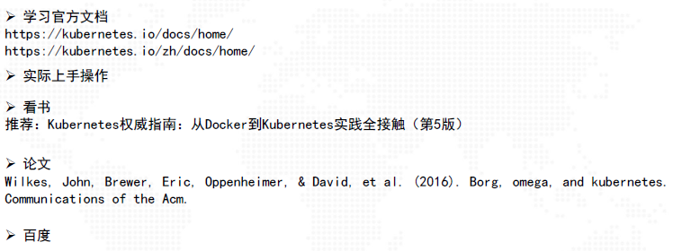
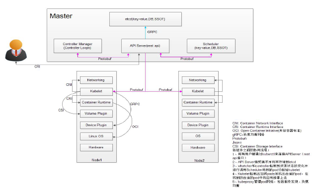
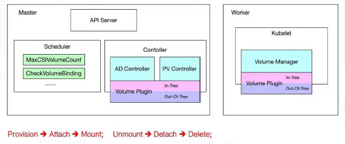
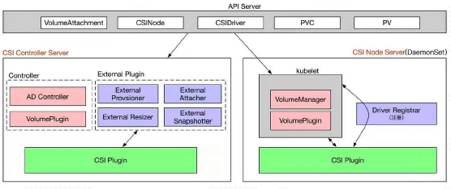
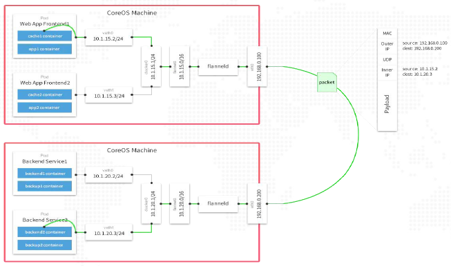
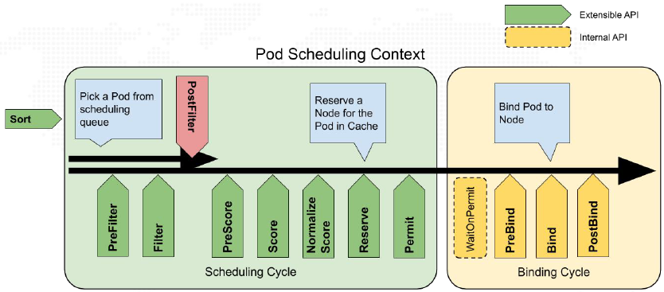
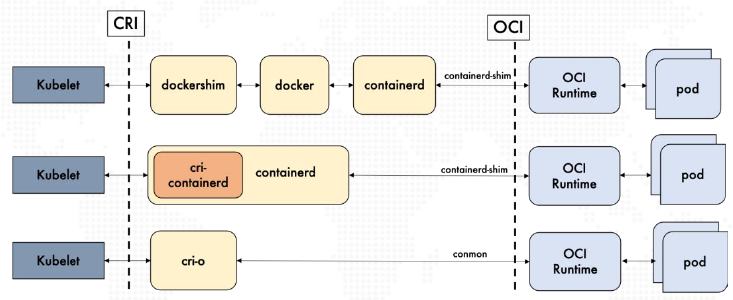

Lec7-K8S入门
---

# 1. 为什么需要K8S？

## 1.1. 容器是什么？
1. 容器是资源精细化编排的代表。
2. 容器通常指在一个隔离的环境中运行的进程以及进程所依赖的环境的总称。
   1. 隔离：借助于linux的namespace机制
   2. 资源限制：可以基于linux的cgroup计算对容器所能使用的资源做限制，主要指cpu、内存资
   3. 进程：linux进程
   4. 依赖环境：进程运行所依赖的库、以及其他的资源
3. 容器的优点
   1. 更轻量
   2. 资源利用更高效
   3. 以应用为中心的管理

## 1.2. 为什么需要K8S
1. 需要一个系统来管理集群上的大量容器。
2. 用于完成容器的编排，目前K8S已经是容器编排领域事实上的标准。

# 2. 什么是K8S
1. K8S是一个可移植、可扩展的开源平台，用于管理容器化的工作负载和服务，可促进声明式配置和自动化。
2. 能力
   1. 支持不同的底层资源平台
   2. 自动弹性伸缩
   3. 高可靠性

## 2.1. K8S逻辑架构
1. Master节点
   1. API Server
   2. Schuduler
   3. Controller
   4. etcd
2. Node节点
   1. pod
   2. docker
   3. kubelet
   4. kube-proxy
   5. fluentd

## 2.2. K8S组件
1. 控制平面：对集群做出全局决策，以及检查和响应集群时间(例如，当不满足部署的replicas字段时，启动新的pod)
   1. kube-apiserver
   2. kube-scheduler
   3. kube-controller-manager
   4. cloud-controller-manager
   5. etcd
2. 计算平面
   1. 计算平面由Node节点组成
   2. 运行组件
      1. Kubelet
      2. Kube-proxy
      3. 容器运行时(Container Runtime)
3. 插件(Addons)
   1. DNS
   2. Dashboard
   3. 容器资源监控
   4. 日志

## 2.3. K8S重要概念

### 2.3.1. POD
1. POD是K8S的最小资源管理单位，POD有点脆弱。
2. POD中包含资源
   1. 一个或多个应用程序容器
   2. 存储卷
   3. 网络地址，如IP地址、端口等

### 2.3.2. Workload 工作负载
1. 工作负载是在K8S上运行的应用程序，K8S主要支持
   1. Deployment
   2. Statefulset
   3. Damonset
   4. Job
   5. CronJob

### 2.3.3. Service
1. Service定义了POD提供给外部应用的方式
2. 为什么引入Service?
3. Service怎么和Pod关联起来？
4. Service有哪些类型
   1. ClusterIP
   2. NodePort
   3. LoadBalancer
   4. ExternalName

### 2.3.4. label
1. label是`key/value`键值对，用来识管理和识别资源。
2. Node、Pod、工作负载、密钥、configmap、service等等所有资源都可以增加标签
3. 签通常用来识别资源，一般和标签选择器配合使用。

# 3. K8S实操
1. 实操会覆盖一个应用的完整的生命周期
2. 实验操作地址：https://kubernetes.io/zh/docs/tutorials/kubernetes-basics/create-cluster/cluster-interactive/

## 3.1. 创建集群
1. 本次实验使用Minikube

```
cat /etc/lsb-release
hostname
hostnamectl set-hostname yanwei
minikube start	
kubectl version
kubectl cluster-info
kubectl get nodes
kubectl get pod -n kube-system
systemctl status kubelet    思考题：kubelet可以放在容器中吗？

kubectl get pod --no-headers --all-namespaces |wc -l
docker ps -a |grep -v NAMES |wc -l

pause容器即infra容器，主要负责为POD准备网络和存储，其他的容器和Pause容器共享网络和存储。
docker inspect 

kubectl get nodes --show-labels
kubectl label nodes <your-node-name> disktype=ssd
```

## 3.2. 部署应用
```
kubectl get nodes //等待节点变成ready状态
kubectl create deployment yanwei.app --image=gcr.io/google-samples/kubernetes-bootcamp:v1
kubectl get pod -o wide
kubectl label pod yanwei.app-65ddbc7454-8fm8g transwarp.io/name=yanwei
```

## 3.3. expose应用
```
kubectl delete deployment kubernetes-bootcamp
kubectl create deployment yanwei.app --image=gcr.io/google-samples/kubernetes-bootcamp:v1
kubectl scale deployments/yanwei.app --replicas=3
kubectl expose deployment/yanwei.app --type="NodePort" --port 8080  --name yanwei

访问service，多次访问service，是从不同的pod中返回的。
curl $(minikube ip):31172

kubectl exec -ti $POD_NAME -- /bin/bash
ps -elf
more server.js
```

## 3.4. 扩容缩容应用
```
kubectl get deployments   
kubectl get rs
kubectl delete deployments kubernetes-bootcamp
kubectl create deployment yanwei.app --image=gcr.io/google-samples/kubernetes-bootcamp:v1

kubectl get deployments   
kubectl scale deployments/yanwei.app --replicas=4
kubectl scale deployments/yanwei.app --replicas=2
```

## 3.5. 滚动升级
```
kubectl delete deployments kubernetes-bootcamp
kubectl delete service kubernetes-bootcamp
kubectl create deployment yanwei.app --image=gcr.io/google-samples/kubernetes-bootcamp:v1

kubectl scale deployments/yanwei.app --replicas=3
kubectl expose deployment/yanwei.app --type="NodePort" --port 8080  --name yanwei

curl $(minikube ip):31120  //执行多次 
kubectl set image deployments/yanwei.app kubernetes-bootcamp=jocatalin/kubernetes-bootcamp:v2
curl $(minikube ip):31120  //执行多次 升级前后查看版本

kubectl rollout status deployments/yanwei.app

升级失败
kubectl set image deployments/yanwei.app kubernetes-bootcamp=gcr.io/google-samples/kubernetes-bootcamp:v10

kubectl get pod -o wide  // 有pod镜像下载失败

kubectl describe pod

kubectl rollout undo deployments/yanwei.app
```

## 3.6. K8S学习建议


# 4. K8S进阶

## 4.1. 设计模式-K8S设计模式
1. 控制器模式：面向期望状态的编程模式
   1. 一个控制器至少管理一种类型的K8S资源。
   2. 每个资源对象都有一个代表期望状态的spec字段。
   3. 该资源的控制器负责确保当前状态趋近期望状态
2. 推荐阅读：《Kubernetes 设计模式》

## 4.2. 设计模式-插件模式


## 4.3. 存储

### 4.3.1. K8S存储架构


### 4.3.2. CSI架构


## 4.4. 网络

### 4.4.1. POD之间通信


### 4.4.2. kube-proxy & kube-dns


### 4.4.3. flannel


## 4.5. 调度


## 4.6. 容器运行时

