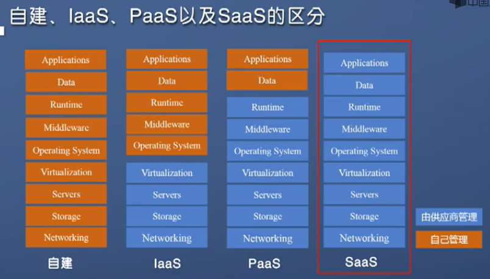

XaaS和IT服务标准
---

# 1. 云计算

1. 例子:每一户都有自己的发电机，但是可以用集中发电的方式来完成。
2. 上面的这个例子就是云计算的想法。

## 1.1. 云提供商提供的服务

## 1.2. 计算能力
1. Linux服务器或Web应用程序

## 1.3. 容器
1. 容器为应用程序提供一致、独立的执行环境。它们类似于 VM，但它们不需要来宾操作系统。 相反，应用程序及其所有依赖项都打包到"容器"中，然后使用标准运行时环境来执行应用。 这样，容器可以在数秒钟内启动，因为没有要启动和初始化的操作系统。 只需启动应用。
2. Docker 容器为应用程序部署提供了一种高效、轻量级的方法，因为通过它们可将应用程序的不同组件独立部署到不同的容器中。 多个容器可以在一台计算机上运行，并且容器可以在计算机之间移动。 由于容器的可移植性，可以非常轻松地将应用程序部署到多个环境(无论是在本地还是在云中)，通常无需对应用程序进行任何更改。

## 1.4. 无服务器计算
1. 借助无服务器计算，无需创建、配置或维护服务器即可运行应用程序代码。

## 1.5. 存储
1. 文件和数据库

## 1.6. 网络
1. 云提供商和公司之间的安全连接

## 1.7. 分析
1. 可视化遥测和性能数据

## 1.8. 云计算提供服务的符合性条款和要求

### 1.8.1. 合规性产品
1. 刑事司法信息服务 (CJIS)。
2. 云安全联盟 (CSA) STAR 认证。
3. 一般数据保护条例 (GDPR)。
4. 等等

## 1.9. 资本支出(CapEx)与运营支出(OpEx)
1. 这是两种不同的投资支出

### 1.9.1. 资本支出(CapEx)
1. 资本支出 (CapEx)：CapEx是预先将资金花在实体基础设施上，然后逐渐从税单中扣除这笔费用。 CapEx是一种前期成本，其价值会随着时间的推移而降低。
2. 计算成本方式
    1. 服务器成本
    2. 存储成本
    3. 网络成本
    4. 备份和存档的成本
    5. 组织连续性和灾难恢复成本
    6. 数据中心基础设施成本
    7. 技术人员
3. 优点:通过资本支出，可在项目或预算期开始时规划成本。 成本是固定的，这意味着可以确切知道花了多少钱。 由于预算有限，需要在项目开始之前预测费用，这就很有吸引力。

### 1.9.2. 运营支出(OpEx)
1. 运营支出 (OpEx)：OpEx是现在花钱购买服务或产品，现在为其付费。可以在同一年从税单中扣除此项费用。无前期成本。你可以在使用服务或产品时为其付费。
2. 计算成本方式
    1. 租用软件和自定义功能
    2. 根据使用/需求而不是固定硬件或容量来缩减费用
    3. 在用户或组织级别计费
3. 优点:需求和增长可能无法预测，并且可能超出预期，这对 CapEx 模型来说是一个挑战，如下图所示。

# 2. XaaS(X as a Service)

1. 下层为上层按照契约进行服务

## 2.1. 典型的三大XaaS
1. SaaS:软件即服务

2. IaaS:基础设计即服务

3. PaaS:平台即服务

## 2.2. 三大XaaS的区别

1. 注意用户的管理的不同的部分
2. 很多厂商会兼容IaaS和Paas甚至还有SaaS

## 2.3. 其他的XaaS
1. 存储即服务(storage as a service，)
2. 安全即服务：SECaaS(security as a service)
3. 数据库即服务：DaaS(database as a service
4. 监控/管理即服务：MaaS(monitoring/management as a service)
5. 通信、内容和计算即服务：CaaS(communications, content and computing as a service)
6. 身份即服务：IDaaS(identity as a service)
7. 备份即服务：BaaS(backup as a service)
8. 桌面即服务：DaaS(desktop as a service)

## 2.4. IT服务标准

### 2.4.1. CMMI-SVC(能力成熟度模型)

1. SVC是service的缩写

### 2.4.2. ITIL(信息技术基础架构库)

### 2.4.3. ISO20000

1. 方法:PDCA(戴明环)
   1. PLAN
   2. DO
   3. CHECK
   4. ACTION

### 2.4.4. ITSS(信息技术服务标准)

# 3. DevOps和XaaS
1. DevOps对应相应的服务