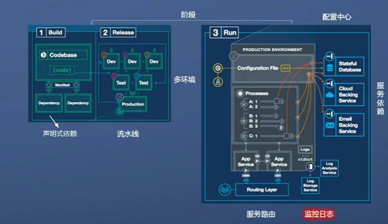
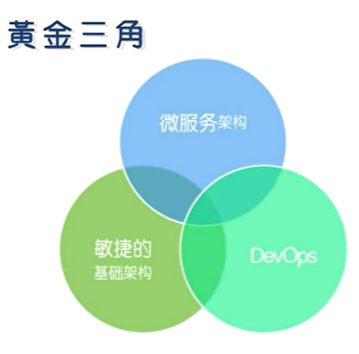

云原生与容器技术
---

# 1. 独角兽成功秘诀
1. 独角兽公司(特斯拉等很大的公司)
2. 内容
   1. Speed of innovation 天下武功，唯快不破
   2. Always-available services 随时随地可用
   3. Web Scale 从0到1 快速扩展
   4. Mobile-centric user experiences 移动为王

# 2. 云原生和线代应用十二范式

1. 依赖关系通过声明的方式声明依赖关系，从一个产品仓库中拉取
2. 后端服务就是一种资源，不关心实现
3. 开发环境 + 测试环境 + 生产环境
4. 进程:无状态，可以做扩展
5. 并发:很多进程协作
6. 端口
7. 易处理:轻量级
8. 开发环境和线上环境等价
   1. 配置不同
   2. 操作系统不同
9. 日志作为时间流，存储自己的输出流
10. 管理进程

## 2.1. 实际过程图

1. 针对不同的开发环境、测试环境、生产环境等等有不同的举措进行部署运行
2. 配置中心指定从哪里对接服务

## 2.2. 云原生
1. 云原生是一种高效组织的一种模式，快速的一致的可靠的规格化交付软件
2. DevOps关注交付过程中

## 2.3. 黄金三角

1. 开发和运维之间的隔阂
   1. 知识隔阂
   2. 过程隔阂
2. 现在开发和运维:
   1. 共同为业务的成功负责
   2. 技能要求一部分融合

## 2.4. 持续交付
1. 瀑布开发模式(大型项目选择)
2. ToC和ToB的发布和部署的周期大大缩短。
3. MVP:最小化产品。

## 2.5. 容器技术
1. 标准化(将应用和扩展库压缩成标准镜像)